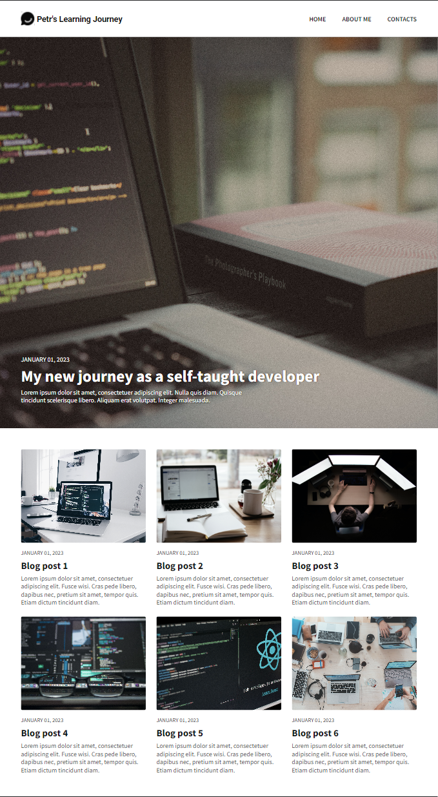
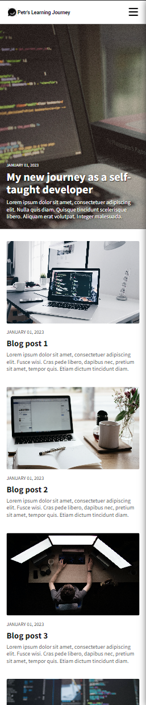
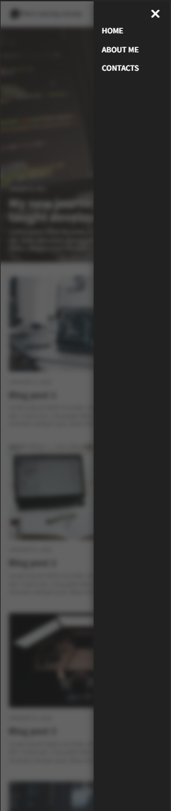
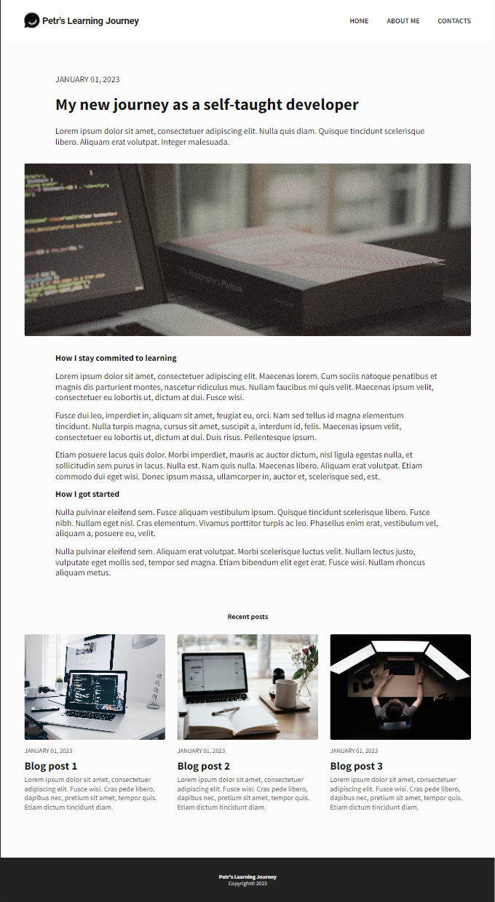
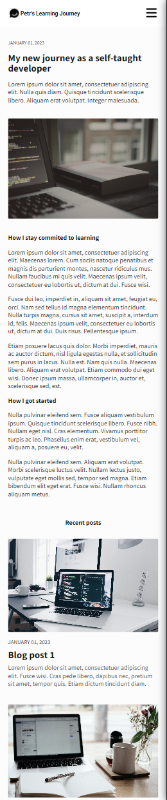
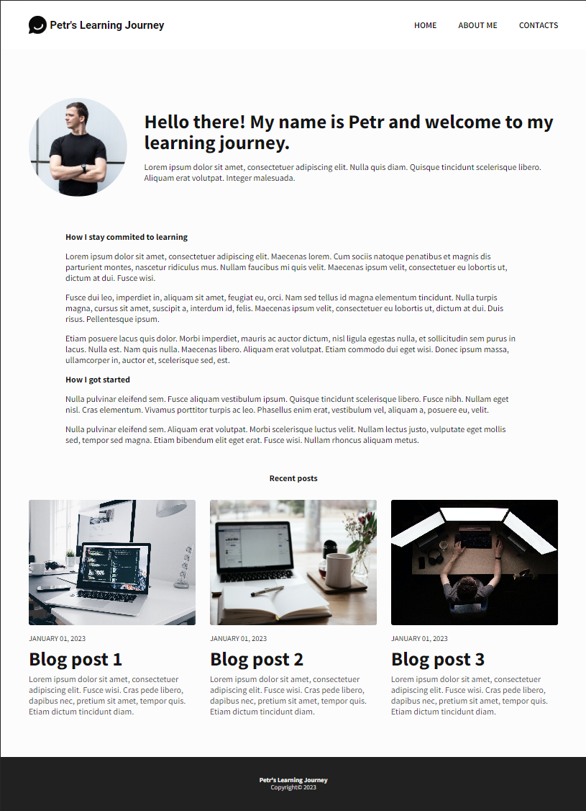
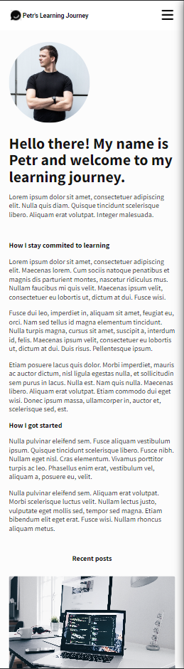
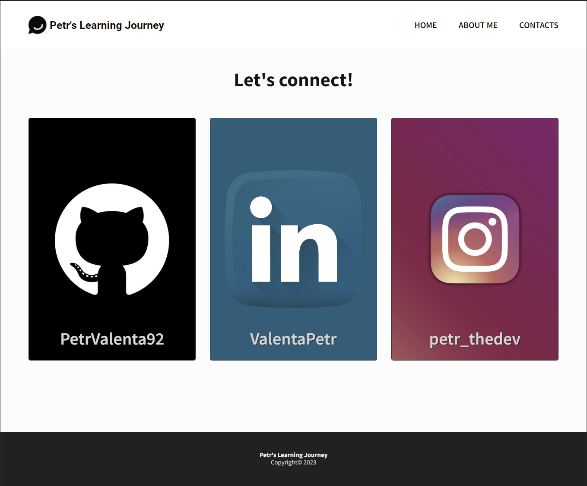
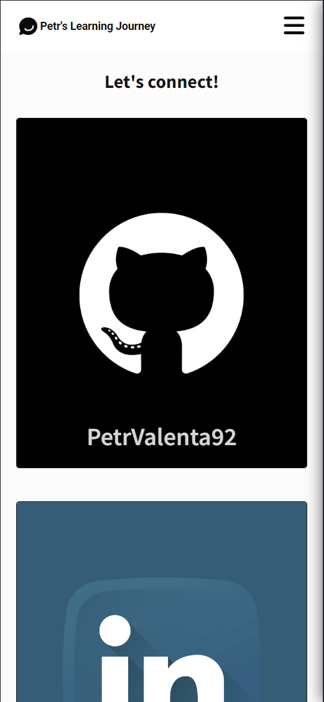

# Scrimba - The Frontend Developer Carrer Path - Module 6 - Learning Journal webpage project

Hello and welcome! Thank you for stopping by.🤠

This is a solution to the Learning Journal webpage project from _Module 6 - Responsive design_ of the [The Frontend Career Path](https://scrimba.com/learn/frontend).

## Table of contents

- [Overview](#overview)
  - [The project](#the-challenge)
  - [Screenshot](#screenshot)
  - [Links](#links)
- [My process](#my-process)
  - [Built with](#built-with)
  - [What I learned](#what-i-learned)
  - [Continued development](#continued-development)
- [Author](#author)
- [Acknowledgments](#acknowledgments)
- [About Scrimba](#about-scrimba)

## Overview

### The project

The Learning Journal webpage allows users to do/see following:

- View a "home" page with a link to one "recent article" which is clickable
- View a "recent article" page
- View a "about me" page
- View a "contacts" page with clickable links to my GitHub, LinkedIn and Instagram accounts
- View and use "burger" menu icon when viewport is 560px and smaller
- The layout is fully responsive!

### Screenshot

Home page

Article page

About page

Contacts page

### Links

- Solution URL: [Github Repository](https://github.com/PetrValenta92/learning-journal)
- Live Site URL: [Github Pages](https://petrvalenta92.github.io/learning-journal/)

## My process

### Built with

- Semantic HTML5 markup
- CSS custom properties
- CSS pseudoclasses
- Flexbox
- GRID
- Mobile first design
- Multiple pages design
- Accessibility focus design
- Responsive design
- Relative units
- Media queries
- Viewport meta tags

### What I learned

...

### Continued development

In future I would like to fill the page with my own original contant. Pictures and texts are going to be authentic and personal. With that I would like to add more articles which would be accessible (there will be a link on them). Next thing would be finishing the "View more" button, which is already prepared, but I need more time to finishing all the styling and javascript code.

## Author

- Website - _to be added..._
- GitHub - [@PetrValenta92](https://github.com/PetrValenta92)
- LinkedIn - [@valentapetr](https://www.linkedin.com/in/valentapetr/)
- Instagram - [@petr_thedev](https://www.instagram.com/petr_thedev/)

## Acknowledgments

I would love to thank whole [Scrimba](https://scrimba.com) team for such amazing project they have created. I want to thank the Scrimba community and specialy the [Junior Guru Community](https://junior.guru/) community! 🐣

## About Scrimba

At Scrimba our goal is to create the best possible coding school at the cost of a gym membership! 💜
If we succeed with this, it will give anyone who wants to become a software developer a realistic shot at succeeding, regardless of where they live and the size of their wallets 🎉
The Frontend Developer Career Path aims to teach you everything you need to become a Junior Developer, or you could take a deep-dive with one of our advanced courses 🚀

- [Our courses](https://scrimba.com/allcourses)
- [The Frontend Career Path](https://scrimba.com/learn/frontend)
- [Become a Scrimba Pro member](https://scrimba.com/pricing)

Happy Coding!
